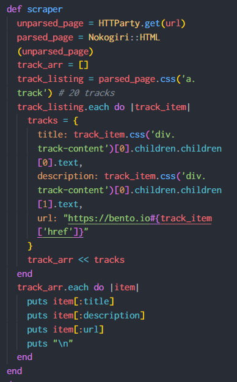
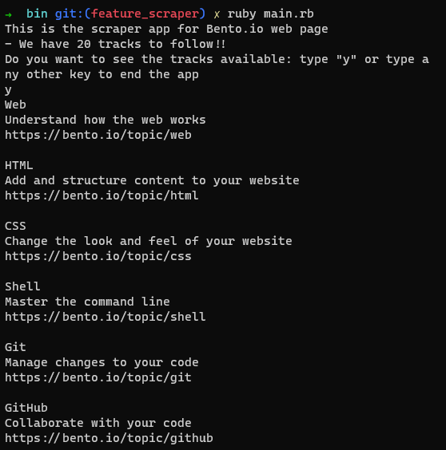

# Ruby_capstone_web_scraper

 In this repository I build a scraper app that obtain a list of track from `https://bento.io` and show the data in the terminal as just text.
 I chose this web page becasuse is a good resource I used for learning at the beginning before starting Microverse.

 ## Images

 
 

 ## Specificacion of the project

 You can find the specifiaction in this [link](https://www.notion.so/Build-your-own-scraper-f54eaca54d8a4d758a5f0141468127a8)
 
 ## bin

 Within the `bin/` directory we generally put code that relates to running our actual program, running CLI applications Executable files are any files that contain instructions in a form that a computer's operating system or application can understand and follow. 

 ## lib

The `lib/` or Library directory in most Ruby programs and the app/.

## Built With

- Ruby

Gems:

- HTTParty
- Nokogiri

## Setup for the game

- Follow these simple example steps.
- Install Ruby on your local machine
- Clone this repository into your computer
- To run, enter this command in your terminal `ruby main.rb` inside the `/bin` folder

### Prerequisites

Only Ruby.

### Run tests

- Install RSpec by typing in your terminal `gem install rspec`
- After the installation is over, just type the command `rspec` in your teminal to check the results of the tests.

## Author

👤  **Alejandro Toledo**
- GitHub: [@alejandrotoledoweb](https://github.com/alejandrotoledoweb)
- Twitter: [@alejot](https://twitter.com/alejot)
- LinkedIn: [LinkedIn](https://www.linkedin.com/in/alejandro-toledo-3b444b109/)

## 🤝 Contributing

Contributions, issues, and feature requests are welcome!

Feel free to check the [issues page](https://github.com/alejandrotoledoweb/ruby_capstone_web_scraper/issues).

## Show your support

Give a ⭐️ if you like this project!

## Acknowledgments

Ruby Capstone Project for Microverse Program